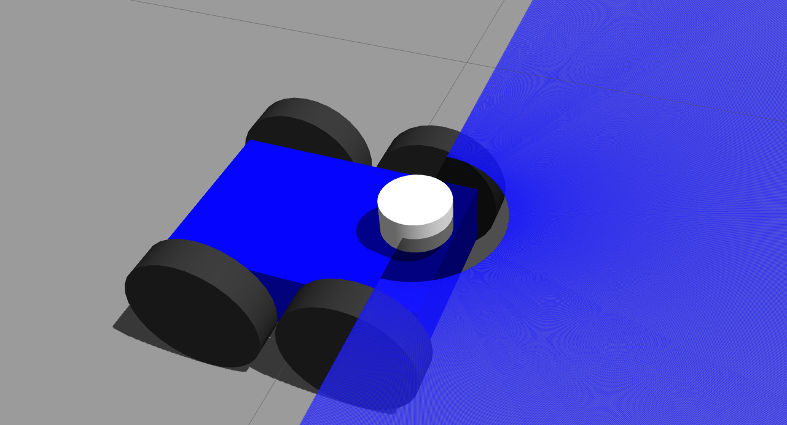

# Armbot Navigation Package
This ROS package contains the navigation stack for a custom 4-wheel skid-steer drive robot in Gazebo. The robot is equipped with a 2D-Laser Scanner, a RGBD Camera and an IMU. The purpose of this package is to learn and explore ROS Navigation Stack. The URDF for the robot has a utilitarian design and does not include any mesh files for complex view or geometry. Any one interested with improving the visual aesthetics or geometrical complexity, feel free to do so by modifying the base URDF files.

<p align="center">
  
</p>


This project was tested on Ubuntu 20.04 LTS with ROS Noetic. Check the ROS official documentation for the Installation [ROS Installation](http://wiki.ros.org/noetic/Installation/Ubuntu).

## Dependencies and Prerequisites
- [gmapping](http://wiki.ros.org/gmapping): `sudo apt install ros-noetic-gmapping`
- [ros_control](http://wiki.ros.org/ros_control): `sudo apt install ros-noetic-ros-control ros-noetic-ros-controllers`
- [navigation](http://wiki.ros.org/navigation): `sudo apt install ros-noetic-navigation`
- [robot_localization](http://docs.ros.org/en/noetic/api/robot_localization/html/index.html): `sudo apt install ros-noetic-robot-localization`
- [catkin_tools](https://catkin-tools.readthedocs.io/en/latest/installing.html): `sudo apt install python3-catkin-tools`

## Installation
Follow the steps below to install the package. It has been assumed that the ROS workspace folder name is `catkin_ws` and is present inside the home folder (`~/`). 
```
cd ~/catkin_ws/src
git clone https://github.com/prabinrath/armbot_nav.git
catkin build armbot_nav
source ~/catkin_ws/devel/setup.bash
```

## Manual Navigation for Map Generation
> Step 1
```
roslaunch armbot_nav armbot_gazebo.launch
```
This will launch the Gazebo simulator to instantiate the robot with controllers and sensors. The gazebo skid-steer drive plugin will publish the odometry transform between `odom` -> `base_link` frames. The `joint_state_publisher` along with the `robot_state_publisher` will update the TF for the whole robot based on the provided URDF file and realtime motion of the robot in the gazebo environment. This command also pops-up a `rviz` window with global frame set to `map`. Visualizations on this window will start after the following step.
> Step 2
```
roslaunch armbot_nav armbot_gmapping.launch
```
This will start the SLAM node using the `gmapping` package. It will also publish the map transform between `map`->`odom` frames. With this the TF tree will be fully connected and the visualization will start on the `rviz` window. 
> Step 3
```
rosrun armbot_nav armbot_nav_teleop.py
```
This is a terminal node for sending command velocities to the robot. Use the on screen instructions to manually navigate the robot. While navigating through the gazebo environment the map will get updated in realtime which can be visualized in the `rviz` window. Once mapping is complete use the command `rosrun map_server map_saver -f map` to save the generated map for later use.

<p align="center">
  
</p>

## Offline Navigation on Generated Map
> Step 1
```
roslaunch armbot_nav armbot_gazebo.launch
```
Spin up Gazebo and RViz.
> Step 2
```
roslaunch armbot_nav armbot_offline_nav.launch 
```
This will start the `map_server`, `amcl` and `move_base` nodes. Map server will publish the offline map and AMCL will adjust the transform between `map`->`odom` frames to localize the robot within the map. With this the TF tree will be fully connected and the visualization will start on the `rviz` window. Move base will initialize the global and local costmaps for navigation.
> Step 3

Use the `2D Nav Goal` button on RViz to assign a navigation goal to the robot within the map. Now the robot should navigate to the assigned goal and the same will be visualized on both Gazebo and RViz.

<p align="center">
  
</p>

## Online Navigation and Autonomous Exploration
The manual driving involved in the map generation process can become cumbersome for large maps. This process can be automated where the robot autonomously explores the unknown spaces in the environment and generates the map. It requires installation of an additional ROS package called [rrt_exploration](http://wiki.ros.org/rrt_exploration). 

Follow the steps below to install the package. It has been assumed that the ROS workspace folder name is `catkin_ws` and is present inside the home folder (`~/`). 
```
cd ~/catkin_ws/src
git clone https://github.com/hasauino/rrt_exploration.git
catkin build rrt_exploration
source ~/catkin_ws/devel/setup.bash
```

> Step 1
```
roslaunch armbot_nav armbot_gazebo.launch
```
Spin up Gazebo and RViz.
> Step 2
```
roslaunch armbot_nav armbot_online_nav.launch 
```
This will start the `gmapping` and `move_base` nodes. Gmapping will publish the transform between `map`->`odom` frames. With this the TF tree will be fully connected and the visualization will start on the `rviz` window. Move base will initialize the global and local costmaps for navigation.
> Step 3
```
roslaunch armbot_nav rrt_explore.launch
```
This will start the `rrt_exploration` node. Please follow the tutorial [here](http://wiki.ros.org/rrt_exploration/Tutorials/singleRobot) to start the autonomous exploration. It involves publishing 5 points in a particular sequence to the `rrt_exploration` node using the `Publish Point` button on RViz. With a successful initiation the robot should start exploring the environment autonomously and the same will be visualized on both Gazebo and RViz.

<p align="center">
  
</p>